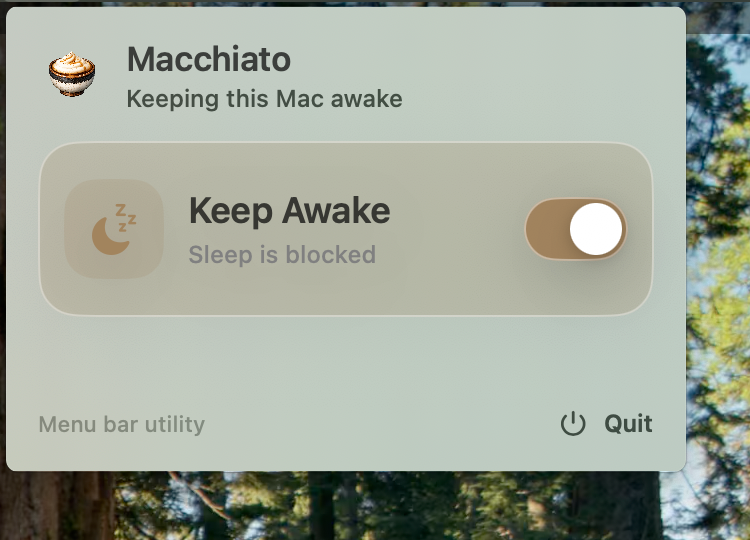

<p align="center">
  
</p>

<h1 align="center">Macchiato</h1>

<p align="center">
  A tiny macOS menu bar utility that keeps your Mac awake with one button.
</p>

## What It Solves

Mac-chiato is built for people who leave long-running work on their Mac: coding agents, local automation, builds, data jobs, model runs, downloads, and anything else that should keep going while you step away.



When you need to close your computer, you should be able to close it normally. No leaving the lid slightly open, no changing system settings by hand, and no wondering whether the agent that was halfway through a task got interrupted.

Macchiato gives you a single menu bar switch:

- **On:** keep the Mac awake, including lid-closed use.
- **Off:** restore normal macOS sleep behavior.

## Extra Safety Features

- **Low-battery back-off.** While Keep Awake is on, Macchiato watches the battery. If the level reaches **10% or less on battery power** (not charging), it automatically turns Keep Awake off — releasing the power assertion and restoring normal sleep via `pmset disablesleep 0` — and posts a notification explaining why. The app keeps running, so you can turn Keep Awake back on once the Mac is plugged in.
- **Lid-closed screen handling.** `pmset disablesleep` keeps the Mac awake with the lid closed, but the built-in display then stays powered at full brightness inside a closed lid (heat + wasted battery). Macchiato reads the lid angle sensor and, while Keep Awake is on, either **dims the built-in screen to black** (default, brightness restored on open) or **sleeps the built-in display**. Pick the mode from the "On lid close" control in the menu; external displays are never touched.
- **Optional: no lock while the lid is closed.** macOS normally asks for a password right after the screensaver engages or the display turns off, so opening a lid-closed Mac means unlocking it first. With "Prevent lock while lid closed" enabled, Macchiato periodically asserts user activity while the lid is closed, keeping the session unlocked so opening the lid lands straight on the desktop. Off by default; if the app exits, the normal lock policy resumes within a minute.
- **Optional: mute while the lid is closed.** With "Mute while lid closed" enabled, Macchiato silences the default output when the lid closes and restores it when the lid opens — notification sounds stay quiet while the Mac works inside a closed lid. Sound the user had muted themselves is never un-muted on open. Off by default.

## How To Use

1. Launch **Macchiato**.
2. Click the menu bar icon.
3. Turn on **Keep Awake** before starting or leaving a long-running task.
4. Close the lid whenever you need to move, pause, or put the Mac aside.
5. Turn **Keep Awake** off when you want macOS to sleep normally again.

The first time Macchiato enables lid-closed sleep control, macOS may ask you to approve **Macchiato Helper** in System Settings. After that approval, the regular on/off switch should work without asking for administrator credentials every time.

## Good For

- Agents that continue working while you are away from the keyboard.
- Local development servers, builds, test runs, and scripts.
- Long downloads, syncs, exports, or processing jobs.
- Any moment where you want to close the MacBook without babysitting the lid.

For long sessions, keep an eye on battery and heat, especially if the Mac is closed and not plugged in.

## If Something Goes Wrong

If Macchiato is force-quit or crashes while enabled, you can manually restore normal sleep behavior:

```sh
sudo pmset -a disablesleep 0
```

## Development

Macchiato uses an IOKit `PreventUserIdleSystemSleep` assertion plus macOS' `pmset disablesleep` setting. The app ships a privileged LaunchDaemon helper, installed through `SMAppService`, so the system-level `pmset` work is approved once instead of prompting on every toggle.

Internal distribution uses the project's private signing flow. Release builds must not include debug signing entitlements such as `get-task-allow`, and the app and embedded helper must be signed consistently before packaging the DMG. Users approve/trust the internal build through macOS, then Macchiato registers the helper through `SMAppService`.

Build locally:

```sh
xcodebuild -project Macchiato.xcodeproj -scheme Macchiato -configuration Debug build
```

Build the internal distribution DMG:

```sh
scripts/build-dmg.sh
```

Additional `xcodebuild` build settings can be passed through when needed by the internal signing flow.

The `Macchiato` target depends on `Macchiato Power Helper` and embeds the helper executable plus its launchd plist into:

```text
Macchiato.app/Contents/MacOS/app.macchiato.Macchiato.PowerHelper
Macchiato.app/Contents/Library/LaunchDaemons/app.macchiato.Macchiato.PowerHelper.plist
```

## Verify The Assertion

Launch the app, turn on **Keep Awake**, then run:

```sh
pmset -g assertions | grep Macchiato
```

You should see a `PreventUserIdleSystemSleep` assertion named `Macchiato is keeping your Mac awake`.

You can also verify the lid-closed sleep setting:

```sh
pmset -g live | grep SleepDisabled
```

## Local Sleep Logging Test

The repo includes two local scripts for manual acceptance testing:

```sh
scripts/sleep-log-runner.sh --scenario lid-closed-off
scripts/sleep-log-runner.sh --scenario keep-awake-on
scripts/analyze-sleep-log.sh sleep-test-logs/*.csv
```

Suggested flow:

1. Ensure Macchiato is off, start `scripts/sleep-log-runner.sh --scenario lid-closed-off`, close the lid or otherwise trigger the sleep condition, wait 10 minutes, reopen the Mac, then stop the logger with Ctrl+C.
2. Turn on **Keep Awake**, start `scripts/sleep-log-runner.sh --scenario keep-awake-on`, repeat the 10 minute window, reopen the Mac, then stop the logger.
3. Run `scripts/analyze-sleep-log.sh sleep-test-logs/*.csv`.

The analyzer reports sample count, wall time, maximum timestamp gap, whether the Macchiato power assertion was observed, and how many samples saw `SleepDisabled=1`. A large gap means the logger stopped running during the test window, which usually indicates sleep.
